```python
from useful_fns import *

# Suppress warning messages for clarity
blockPrint()
import warnings
warnings.filterwarnings('ignore')

from Reproducibility import *

# Resize height of scrollable output for viewing purposes
from IPython.core.display import display, HTML
display(HTML("<style>div.output_scroll { height: 1000em; }</style>"))

matplotlib.rcParams['figure.figsize'] = (10.0, 5.0) 
```


<style>div.output_scroll { height: 1000em; }</style>


### Kindly place all the data files/folders into the do-not-track folder of the repository. 

## Figure 1

Subfigure Notes:  
B & G - Represent our data input and can be generated by running Show_SCM() and Show_FCM() respectively.  
F - Also represents our and can be generated with brainrender_regions.py.  Due to compatability issues between TVB and BrainRender, we do not show the output here.   
The other figures are for illustration purposes. 


```python
Show_SCM()
```


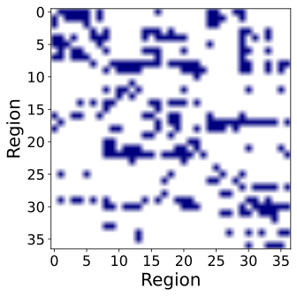


```python
Show_FCM()
```


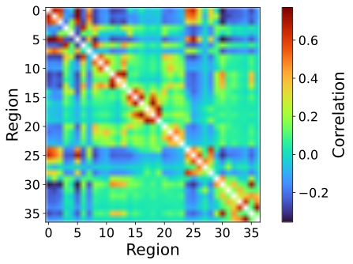


```python
Het_Sample_Figures_Fig1()
```


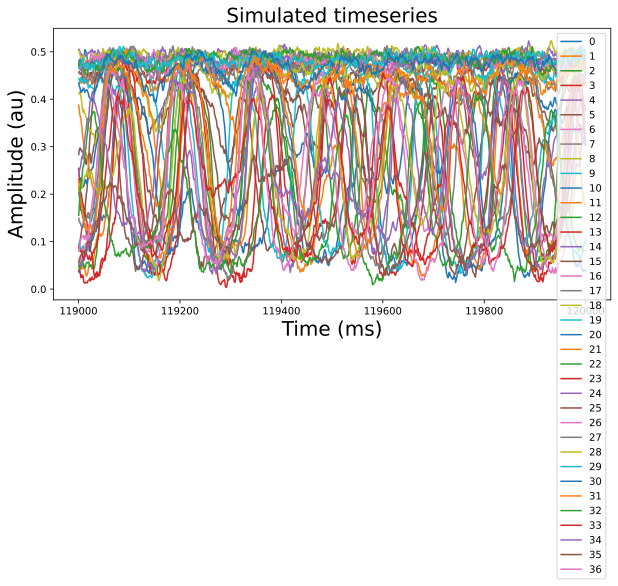


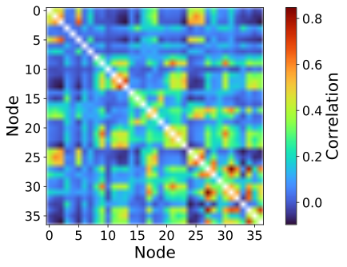


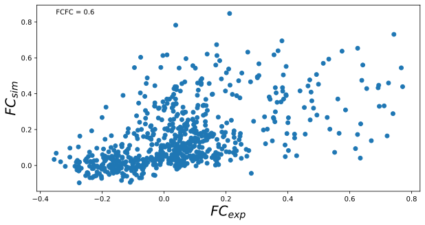


## Figure 2

A-C: Output of Homog_sweep(Path_to_Regime) with the appropriate folder path to the files pertaining the desired Parameter Regime.  
D-F: Output of Bif_Diagram_Generation().  We note that the sample current ranges in the paper were inputted manuualy after analysis of simulations using inkscape. 


```python
Homog_sweep(r"do-not-track\\2020_09_23\\LCycle*Scorr*.csv")
```


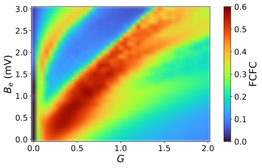


```python
Homog_sweep(r"do-not-track\\2020_10_05\\FixedPt*Scorr*.csv")
```


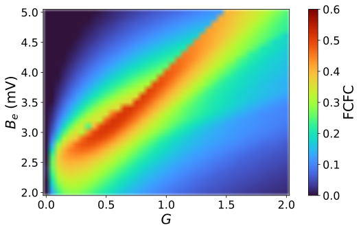


```python
Homog_sweep(r"do-not-track\\2020_10_06\\Hysteresis*Scorr*.csv")
```


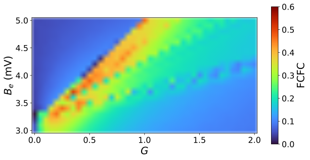


```python
Bif_Diagram_Generation()
```


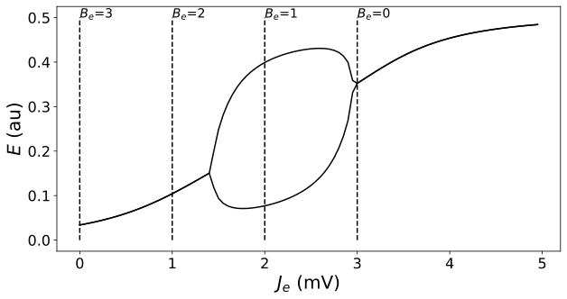


## Figure 3 

A : See Figure 2.   
B & E : See Output of Single_Run_Plots() for Region ii.   
C & F : See Output of Single_Run_Plots() for Region iii.  
D & G : See Output of Single_Run_Plots() for Region iv.  

## Figure 4  

See Output of Single_Run_Plots for Region iv.   


```python
# Region ii

Regime = "LCycle"
G_value = 0.45
B_e_value = 2.8

File_start = r"do-not-track\\2020_09_23\\"  + Regime + "_G[[]" + str(G_value) + "[]]_b_e[[]" + str(B_e_value) + "[]]"

Single_Run_Plots(File_start,Regime,G_value,B_e_value)
```


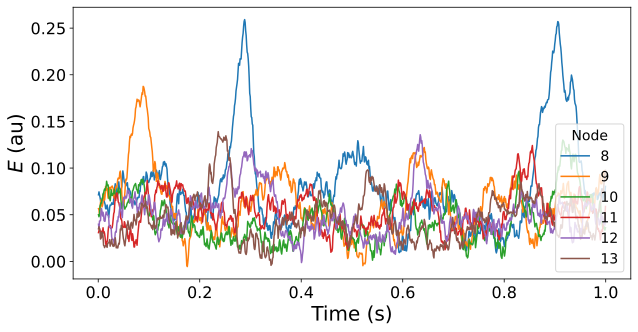


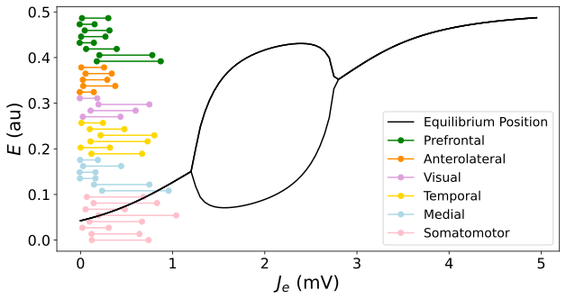


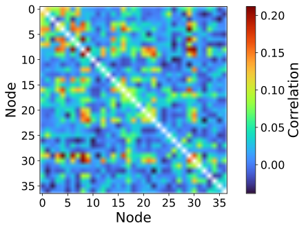


```python
# Region iii

Regime = "LCycle"
G_value = 0.45
B_e_value = 2

File_start = r"do-not-track\\2020_09_23\\"  + Regime + "_G[[]" + str(G_value) + "[]]_b_e[[]" + str(B_e_value) 

Single_Run_Plots(File_start,Regime,G_value,B_e_value)
```


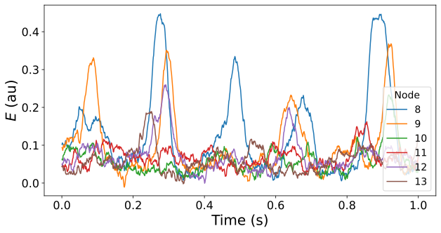


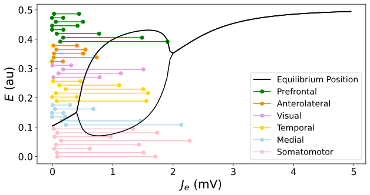


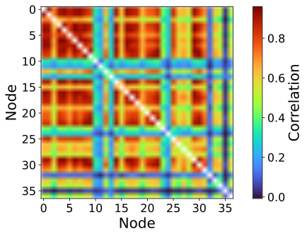


```python
# Region iv

Regime = "LCycle"
G_value = 0.7
B_e_value = 1.5

File_start = r"do-not-track\\2020_09_23\\"  + Regime + "_G[[]" + str(G_value) + "[]]_b_e[[]" + str(B_e_value) + "[]]"

Single_Run_Plots(File_start,Regime,G_value,B_e_value)
```


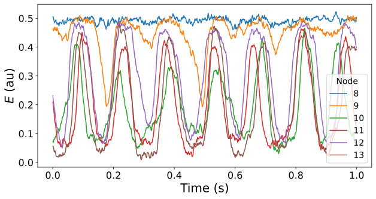


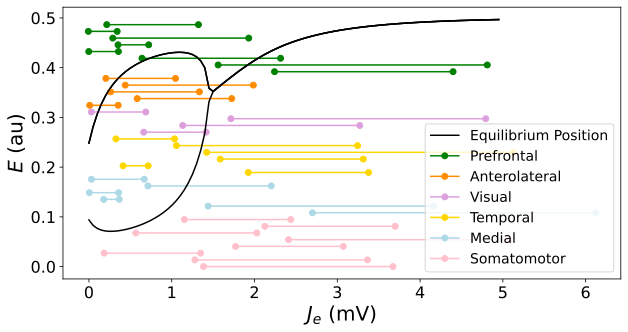


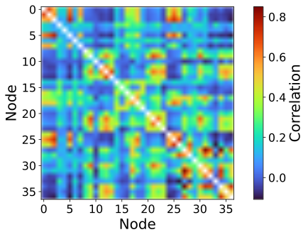


## Figure 5

A - D : Run LCycle_Het_Bif_Diagrams(Regions,Scaling)  
Where: Regions = 6, Scaling = 0.1  
Scaling is the extent of the perturbation allowed.
 


```python
LCycle_Het_Bif_Diagrams(6,0.1)  
```


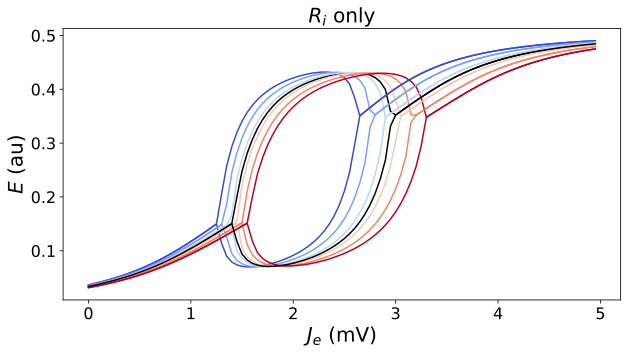


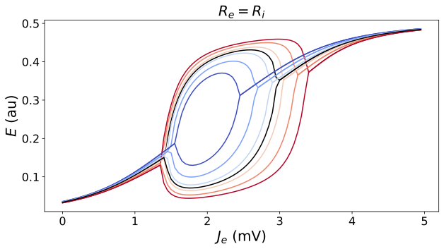


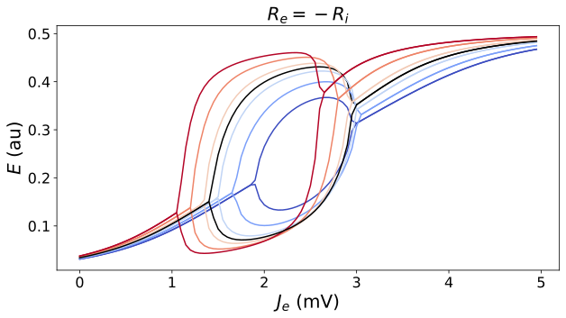


## Figure 6

A - D : Run Single_Run_Het_Plots(File_start,Regime,G_value,B_e_value,sig_e,sig_i)  
E: Run Show_Sig_sweep()


```python
Regime = "LCycle"
G_value = 0.7
sig_e = 0.2
sig_i = 0.2
B_e_value = 1.5

File_start = r"do-not-track\\2021_01_25\\" + Regime +"*_G[[]" + str(G_value) + "[]]*sig_e" + str(sig_e) + "_sig_i" + str(sig_i)

Single_Run_Het_Plots(File_start,Regime,G_value,B_e_value,sig_e,sig_i)
```


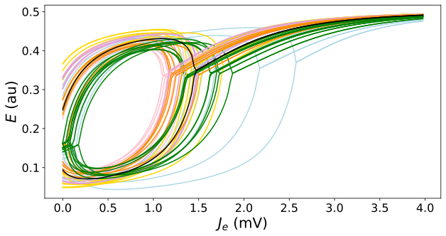


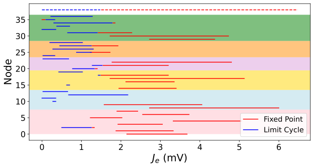


```python
Show_Sig_sweep()
```


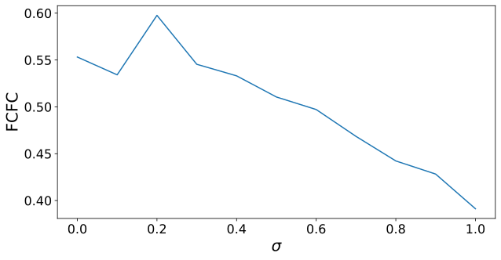


## Figure 7

A : ShuffleValidations()  
B : BenchmarkingVsLitereature()  


```python
ShuffleValidations()  
```


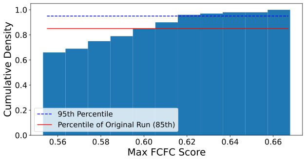


```python
BenchmarkingVsLitereature()  
```


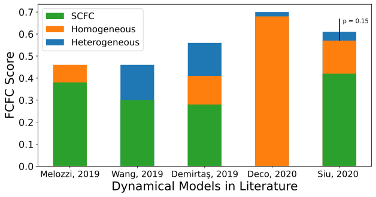


## Supplementary Figures

S2 - Fixed Pt Model : Single_Run_Plots(File_start,Regime,G_value,B_e_value)  
S3 - Hysteresis Model : Single_Run_Plots(File_start,Regime,G_value,B_e_value)  
S5 - $\pm50\%$ LCycle Heterogeneous Bifurcation Diagrams : LCycle_Het_Bif_Diagrams(6,0.5)    
S6 - Hysteresis Bifurcation Diagrams :  Hysteresis_Het_Bif_Diagrams(6,0.5)   
Noting that in the paper these were drawn by hand.   
S7 - Identifying the border between Region ii and iii : J_e_Border_Check() 


```python
Regime = "FixedPt"
G_value = 0.65
B_e_value = 3.3

File_start = r"do-not-track\\2020_10_05\\"  + Regime + "_G[[]" + str(G_value) + "[]]_b_e[[]" + str(B_e_value) + "[]]"

Single_Run_Plots(File_start,Regime,G_value,B_e_value)
```


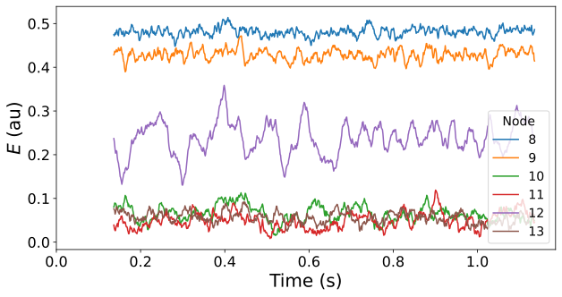


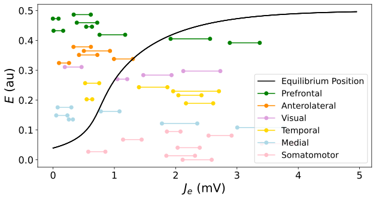


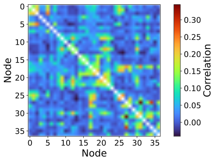


```python
Regime = "Hysteresis"
G_value = 0.35
B_e_value = 3.7

File_start = r"do-not-track\\2020_10_06\\"  + Regime + "_G[[]" + str(G_value) + "[]]_b_e[[]" + str(B_e_value) + "[]]"

Single_Run_Plots(File_start,Regime,G_value,B_e_value)
```


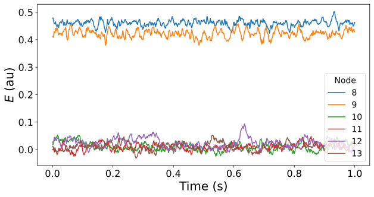


    WARNING  File 'average_orientations' not found in ZIP.
    WARNING  File 'cortical' not found in ZIP.
    WARNING  File 'hemispheres' not found in ZIP.
    WARNING  File 'areas' not found in ZIP.
    Max 2.023416231837847
    Median 0.5974218818401118
    Min -0.015410692627944802
    


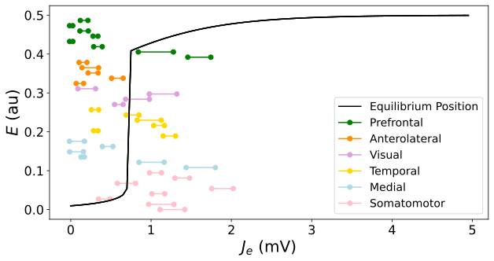


    [5.42201530e-001 1.16755535e-102 5.07998490e-001 5.55818089e-045]
    


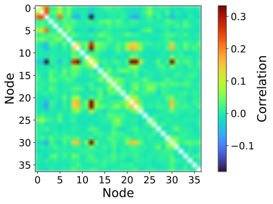


```python
LCycle_Het_Bif_Diagrams(6,0.5)  
```


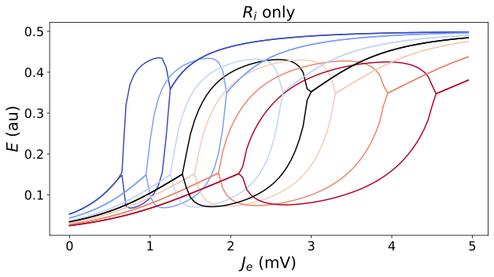


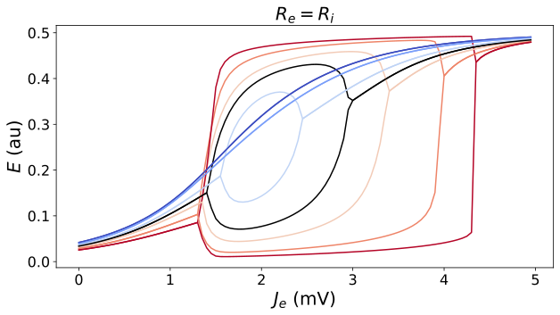


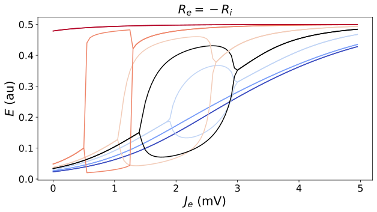


```python
Hysteresis_Het_Bif_Diagrams(6,0.5)
```


```python
J_e_Border_Check() 
```


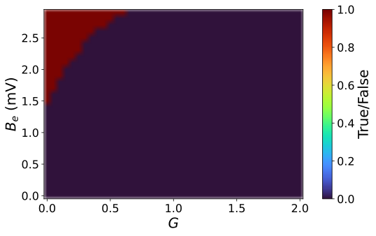


```python

```
